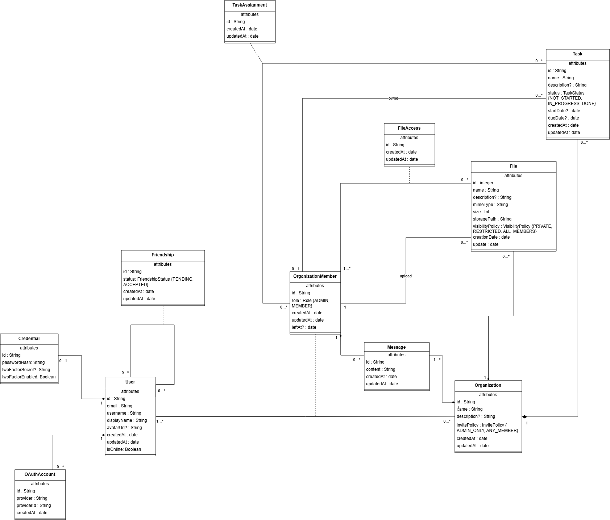

*This project has been created as part of the 42 curriculum by afontele, ndarouec, aibonade, qboutel.*

# Aqan

A collaborative project and task management web application, built as a team of four
for the 42 `ft_transcendence` project.

---

## Table of contents

- [Description](#description)
- [Team Information](#team-information)
- [Project Management](#project-management)
- [Instructions](#instructions)
- [Technical Stack](#technical-stack)
- [Database Schema](#database-schema)
- [Features List](#features-list)
- [Modules](#modules)
- [Individual Contributions](#individual-contributions)
- [Resources](#resources)
- [Use of AI](#use-of-ai)
- [License](#license)

---

## Description

**Aqan** is a productivity web application for teams that need to organise work together:
create a project, invite people into it, split the work into tasks with owners, assignees
and deadlines, share the files the work depends on, and talk about it — all in the same
place, updated live for everyone connected.

The name comes from the initials of the four people who built it, and it is a pun on the
French expression *"à quand"*.

### Key features

- **Projects (organizations)** — create a project, invite members, assign `ADMIN` /
  `MEMBER` roles, control who may invite, transfer or revoke rights, leave or delete.
- **Tasks** — create tasks scoped to a project, with description, status
  (`NOT_STARTED` / `IN_PROGRESS` / `DONE`), start and due dates, an owner and any
  number of assignees; filter by ownership, assignee or unassigned.
- **Agenda** — a monthly view of every task across every project, with a per-project
  colour identity carried on each task row.
- **Project chat** — one persistent conversation per project, delivered in real time
  over WebSockets to everyone in the room.
- **Files** — upload files into a project with real content-type detection, three
  visibility policies (`PRIVATE`, `RESTRICTED`, `ALL_MEMBERS`), per-member access
  grants, in-browser preview, download and deletion.
- **Social layer** — user search, friend requests, friend list, public profiles, and
  live online/offline presence broadcast to friends.
- **Accounts** — email + password sign-up (Argon2 hashing), JWT sessions with an
  httpOnly refresh cookie, 42 and GitHub OAuth 2.0, TOTP two-factor authentication,
  avatar presets or custom upload, profile editing, password change, account deletion.
- **Observability** — the whole stack is instrumented: Prometheus scrapes the backend,
  PostgreSQL, nginx and the host; Grafana renders dashboards; Alertmanager routes
  alerts. All of it is reachable behind the same HTTPS entry point.
- **Legal pages** — Privacy Policy and Terms of Service, linked from the footer of
  every page.

The interface is in French; this README, per the subject, is in English.

---

## Team Information

| Member | 42 login | Formal role | Technical lane |
|---|---|---|---|
| **Nayel** | `ndarouec` | Technical Lead / Architect | Platform & real-time |
| **Quentin** | `qboutel` | Developer | Authentication & social |
| **Aileen** | `aibonade` | PM / Developer | Product core & collaboration |
| **Amanda** | `afontele` | PO / Developer | Observability & infrastructure routing |

### Responsibilities

**Nayel — Platform & real-time.**
Owns the foundations everyone else builds on: the Docker Compose orchestration, the
NestJS and React/Vite scaffolds, the shared Prisma schema and `PrismaService`, the
Socket.IO gateway and its event contract, the presence registry, the front-end routing
table, and the design system (theme, reusable components, per-project colour rules).
Also owns the dependency discipline (pinned versions, committed lockfiles, `npm ci`).

**Quentin — Authentication & social.**
Owns everything about *who the user is* and *how users reach each other*: sign-up and
login, Argon2 password hashing, the JWT access/refresh token pair, the 42 and GitHub
OAuth flows, TOTP 2FA, the user profile and avatar system, the friendship model with
its request/accept/remove lifecycle, and the project chat built on top of Nayel's
gateway.

**Aileen — Product core & collaboration.**
Owns the domain the product is actually about: organizations and their membership and
role rules, tasks with their assignment and visibility model, and the file subsystem
(storage layout, magic-byte type detection, visibility policies, access grants).
Also owns the authorization rules enforced inside those three modules.

**Amanda — Observability & infrastructure routing.**
Owns the monitoring stack end to end: the `prom-client` registry and HTTP interceptor
inside the backend, the Prometheus configuration and alert rules, the node, PostgreSQL
and nginx exporters, the provisioned Grafana datasource and dashboard, Alertmanager
and its receiver, plus the nginx sub-path routing (`/prometheus/`, `/grafana/`,
`/alertmanager/`) and the auth-protected access to those endpoints.

---

## Project Management

### How the work was organised

The team worked in **lanes** rather than by raw point count: each person owns a
coherent technical corridor and goes deep in it, instead of collecting scattered
features. The lanes were chosen so that the dependency graph runs in one direction —
platform first, then authentication, then the product domain, then the data and
observability layers that consume everything else.

The sequencing that followed from that:

1. **Foundations** — scaffolds, Docker, nginx/TLS, ORM and the shared database schema
   (Nayel), in parallel with base authentication (Quentin).
2. **Domain core** — organizations and the beginning of the task model (Aileen), the
   WebSocket gateway and presence (Nayel), profile/avatar and OAuth (Quentin).
3. **Real time & social** — project chat on the shared gateway (Quentin), tasks,
   assignments and files (Aileen).
4. **Observability & finishing** — metrics, Prometheus, Grafana, Alertmanager
   (Amanda), then Privacy/ToS, validation, responsiveness and console cleanliness
   (everyone).

Four files are shared coordination points and were treated as such — announce before
touching, small changes, no silent edits:

| Shared file | Why it is sensitive |
|---|---|
| `srcs/backend/prisma/schema.prisma` | Everyone adds models here; `User` is referenced by almost everything. |
| `srcs/backend/src/realtime/realtime.events.ts` | The single source of truth for WebSocket event names and payload shapes. |
| `srcs/backend/src/app.module.ts` | Small file, big crossroads — every NestJS module registers itself here. |
| `srcs/frontend/src/App.tsx` | The routing table where each member declares their screens. |

### Tools

| Purpose | Tool |
|---|---|
| Source control & code review | **GitHub** — one long-lived branch per member (`Nayel`, `Quentin`, `Aileen`, `amanda`), merged into `main` |
| Communication | **Discord** — day-to-day coordination, quick decisions, screen sharing |
| Synchronous coordination | **In-person working sessions at 42** — architecture decisions, schema design, module scoping |
| Written decisions | **Markdown notes** shared on the Discord team channel — module coherence analysis, integration map, ORM and Prisma conventions, study notes and the meetings reviews |

### Dependency discipline

Because four people install dependencies on four machines, versions are **pinned
exactly** (no `^`, no `~`) in both `package.json` files, and both `package-lock.json`
files are committed. `.npmrc` sets `save-exact=true`, `.nvmrc` pins Node 22,
`.gitattributes` folds lockfile diffs and forbids line-by-line merging, and the
Dockerfiles use `npm ci` rather than `npm install`, so a drifting lockfile fails the
build loudly instead of silently producing a different tree.

---

## Instructions

### Prerequisites

| Requirement | Version / note |
|---|---|
| **Docker + Docker Compose** | Compose v2 (`docker compose`, not `docker-compose`) |
| *or* **Podman + podman-compose** | Used on 42 workstations, where `docker` is a shim over Podman. Fully supported — see below. |
| **make** | Entry point for every command |
| **Google Chrome** | Latest stable — the browser the project is validated against |
| **Node.js 22** | Only needed to run the apps *outside* Docker; the containers provide their own |

Nothing else is installed on the host: the frontend, backend, database, reverse proxy
and monitoring stack all run in containers.

### Running the project

```bash
make up
```

Then open **<https://localhost:8443>** and accept the certificate warning — the TLS
certificate is self-signed, which is expected in local development.

> **Why ports 8080 / 8443 and not 80 / 443?** A non-root process cannot bind to ports
> below 1024. Using unprivileged ports everywhere means the project behaves identically
> under rootless Podman on the school machines and under standard Docker at home.

`make up` is genuinely a single command: if `.env` does not exist, the Makefile creates
it from `.env.example` before starting anything, and the backend entrypoint applies the
Prisma schema and generates the client on boot, retrying until PostgreSQL accepts
connections.

### Configuration (`.env`)

Secrets live in `.env`, which is git-ignored. `.env.example` is the committed template
that documents every expected key. **Before any real use, replace every `change_me`
value and provide your own OAuth credentials.**

| Variable | Purpose |
|---|---|
| `POSTGRES_USER` / `POSTGRES_PASSWORD` / `POSTGRES_DB` | Credentials the official PostgreSQL image uses to create the role and database |
| `DATABASE_URL` | Connection string used by Prisma — host is `database`, the Compose service name |
| `JWT_ACCESS_SECRET` / `JWT_REFRESH_SECRET` | Signing keys for the access and refresh tokens — must differ from each other |
| `JWT_ACCESS_EXPIRES` / `JWT_REFRESH_EXPIRES` | Token lifetimes (`15m` / `7d` by default) |
| `FRONTEND_URL` | Public origin, used for OAuth redirects |
| `OAUTH_42_CLIENT_ID` / `_SECRET` / `_REDIRECT_URI` | 42 OAuth application credentials |
| `OAUTH_GITHUB_CLIENT_ID` / `_SECRET` / `_REDIRECT_URI` | GitHub OAuth application credentials |
| `GF_SECURITY_ADMIN_USER` / `GF_SECURITY_ADMIN_PASSWORD` | Grafana admin account, created on first boot |
| `UPLOAD_DIR` | Where uploaded files are written inside the backend container |
| `MAX_UPLOAD_SIZE_MB` | Application-level upload limit (nginx is set slightly higher, at 12 MB, so the refusal comes from the backend with a readable message) |

Besides `.env`, two files must be filled in before `make up`:

| File | What to put in it |
|---|---|
| `srcs/monitoring/alertmanager/discord_webhook_url` | The Discord webhook URL alerts are delivered to. Alertmanager reads the URL from this file (`webhook_url_file`) because it does not expand environment variables in its configuration. |
| `srcs/nginx/.htpasswd` | A user and a bcrypt password hash, used by nginx to protect the monitoring endpoints. |

### Everyday commands

```bash
make logs    # follow the logs of every service
make ps      # container state (up / healthy / exited)
make down    # stop everything, keep the data
make re      # full restart (down then up)
make clean   # stop and DELETE the volumes — erases the database and every uploaded file
make fclean  # same as clean, and remove the built images
```

### Working with the database

The schema is applied declaratively with `prisma db push` rather than versioned
migrations. This is a deliberate team choice: the subject asks for a clear schema with
well-defined relations, which `schema.prisma` provides directly, and `db push` lets four
people iterate on a shared schema without merge conflicts in a `prisma/migrations/`
directory. The trade-off is real and worth knowing: `--accept-data-loss` allows
destructive changes without confirmation, so renaming a field drops the old column and
its data. Acceptable in development, where the data is disposable.

```bash
docker compose exec backend npx prisma db push    # apply schema changes
docker compose exec backend npx prisma generate   # regenerate the typed client
docker compose exec backend npx prisma studio     # browse the data
```

Or simply `make re`, which does the first two at startup.

### Demo and debugging commands

```bash
# Generate traffic, so the Grafana panels have something to display
for i in $(seq 1 200); do curl -sk https://localhost:8443/api/health > /dev/null; done
for i in $(seq 1 30);  do curl -sk https://localhost:8443/api/nope   > /dev/null; done

# Trigger an alert: stopping a scrape target sends its `up` series to 0
docker compose stop node-exporter

# Inspect the stored password hashes
docker compose exec database psql -U transcendence -d transcendence
# then, inside psql:
SELECT user_id, password_hash FROM credentials;

# Exact size of a file, in bytes
stat -c %s <filename>
```

### Monitoring endpoints

All behind the same HTTPS entry point:

| URL | Service |
|---|---|
| `https://localhost:8443/grafana/` | Grafana dashboards |
| `https://localhost:8443/prometheus/` | Prometheus, targets and alerts |
| `https://localhost:8443/alertmanager/` | Alertmanager, active alerts and silences |

### Running on 42 workstations (Podman)

On school machines `docker` is a shim over Podman (`podman-docker`) delegating to
`podman-compose`. The project is written to work there without modification:

- **Image names are fully qualified** (`docker.io/library/postgres:16-alpine`). Podman
  does not assume Docker Hub and would otherwise ask interactively which registry to
  use — which would break the "one command, no manual step" requirement. Docker accepts
  the same syntax, so a single file serves both environments.
- **Startup order is not trusted.** `podman-compose` frequently ignores
  `depends_on: condition: service_healthy`, so the backend entrypoint retries the Prisma
  migration up to 30 times (60 s) instead of relying on the orchestrator's behaviour.

---

## Technical Stack

**One language end to end: TypeScript.** For a team of four building a heavily
relational, real-time application, a single language means shared types across the
network boundary, and any member can read and debug any other member's code.

### Frontend

| Technology | Version | Why |
|---|---|---|
| **React** | 18.3.1 | Framework requirement of the subject; the component model matches a UI where the same task appears in several views |
| **Vite** | 6.4.3 | Instant hot reload through the bind mount, and a fast production build |
| **TypeScript** | 5.9.3 | Types shared with the backend contracts, especially the WebSocket event shapes |
| **React Router** | 7.18.3 | Declarative routing, with a `RequireAuth` wrapper guarding the private routes |
| **Tailwind CSS** | 4.3.3 | The subject mandates a CSS framework and the evaluation grid states plain CSS is not enough. v4 integrates as a Vite plugin, so the theme is declared in CSS (`@theme` in `styles/theme.css`) with no `tailwind.config.js` |
| **socket.io-client** | 4.8.3 | Client side of the shared real-time gateway |

### Backend

| Technology | Version | Why |
|---|---|---|
| **NestJS** | 10.4.22 | Its module system maps almost 1:1 onto the 42 modules — one NestJS module per feature — and it ships guards, DTO validation and a WebSocket gateway in the same framework |
| **Prisma** | 6.19.3 | Typed queries derived from a single declarative schema file; the schema doubles as the team's shared data contract |
| **Socket.IO** | 4.8.3 | Rooms, automatic reconnection and transport fallback, mounted as a NestJS gateway |
| **Passport + @nestjs/jwt** | 0.7.0 / 10.2.0 | Standard strategy pattern for JWT and OAuth flows |
| **Argon2** | 0.41.1 | Winner of the Password Hashing Competition; memory-hard, salted by default |
| **otplib + qrcode** | 12.0.1 / 1.5.4 | TOTP secret generation, verification, and the QR code shown during 2FA enrolment |
| **class-validator / class-transformer** | 0.15.1 / 0.5.1 | Server-side validation of every DTO through a global `ValidationPipe` |
| **wasmagic** | 1.0.10 | `libmagic` compiled to WebAssembly — detects a file's *real* type from its content, because the client-declared MIME type is forgeable |
| **prom-client** | 15.1.3 | Prometheus metric registry and the default Node.js runtime collectors |

### Database

**PostgreSQL 16 (alpine).** Chosen because the domain is strongly relational — users
belong to organizations, organizations own tasks and files, tasks have owners and
assignees, files have per-member access grants. Almost every read crosses two or three
relations, which is exactly what a relational engine with real foreign keys and indexes
is for. Referential integrity is enforced in the database (`onDelete: Cascade` /
`SetNull`), not only in application code, so a deleted user cannot leave dangling rows.
PostgreSQL also brings native enum types, which map directly onto the domain enums
(`Role`, `TaskStatus`, `VisibilityPolicy`, `FriendshipStatus`, `InvitePolicy`).

### Infrastructure

| Technology | Role |
|---|---|
| **Docker Compose / Podman** | Ten services on one private bridge network, resolving each other by service name |
| **nginx** | The only service exposed to the host. Terminates TLS, redirects `:80` → `:443`, serves the Vite frontend, proxies `/api` and `/socket.io` to NestJS, and mounts Prometheus, Grafana and Alertmanager under sub-paths |
| **Prometheus 3.13** | Metric collection and alert rule evaluation, 15-day retention |
| **Grafana 13.1** | Dashboards built on the metrics Prometheus collects and stores |
| **Alertmanager 0.33** | Alert grouping, inhibition and routing |
| **node / postgres / nginx exporters** | Host, database and reverse-proxy metrics |

### Notable technical decisions

- **HTTPS everywhere from the browser.** Only nginx publishes ports; the frontend,
  backend and database are unreachable from outside the Compose network. Traffic
  *inside* the network is unencrypted, which the subject explicitly allows.
- **Real-time payloads carry identifiers, not entities.** A `task:updated` event sends
  `{ organizationId, taskId }`, and the client re-fetches from the API. The backend
  applies visibility and permission rules the client does not know; a client that
  patched its own state from the payload would drift from the server's truth.
- **Uploaded files are stored outside `/app`.** `/app` is the bind-mounted, versioned
  code; user data lives in a separate named volume at
  `/var/lib/transcendence/uploads`, so an upload can never land in the git repository.
- **Uploads are served by the backend, never by nginx.** Files carry a
  `VisibilityPolicy` and a `FileAccess` table; only application code can evaluate those
  rules, so the uploads volume is deliberately *not* mounted into the nginx container.
- **Opaque storage paths.** `storagePath` is a generated `cuid`, never the original
  filename — no collisions between files with the same name, no path traversal, no
  information leak through the name. The human-readable name is kept in `File.name`.
- **No hard-coded colours in the UI.** Every colour comes from the `@theme` block or a
  `ui/` component. Tailwind only generates classes it finds written out in full, so
  dynamic class names (`` `bg-project-${n}` ``) silently produce no colour — hence the
  explicit lookup table in `lib/projectColors.ts`.

---

## Database Schema

Eleven models and five enums, all in `srcs/backend/prisma/schema.prisma`.

[](docs/images/database-schema.png)

### Conventions

Frozen across the team, so four people produce one coherent schema:

- Primary key always `id String @id @default(cuid())` — short, unique, unguessable and
  URL-safe. Not `autoincrement()`, which would expose sequential ids and collide in a
  distributed or real-time context.
- Every mutable entity carries `createdAt` (`@default(now())`) and `updatedAt`
  (`@updatedAt`).
- Table names are snake_case plural (`@@map("users")`); multi-word fields are mapped to
  snake_case columns (`displayName` → `display_name`).
- `username` is generated rather than chosen: `displayName` + `#` + the last five
  characters of the cuid, with a character bumped on collision.

### Tables

| Model | Table | Key fields | Relations |
|---|---|---|---|
| **User** | `users` | `id` cuid PK · `email` String unique · `username` String unique · `displayName` String · `avatarUrl` String? · `isOnline` Boolean | 1–1 `Credential`, 1–N `OAuthAccount`, 1–N `Friendship` (both directions), 1–N `OrganizationMember` |
| **Credential** | `credentials` | `passwordHash` String (Argon2) · `twoFactorSecret` String? · `twoFactorEnabled` Boolean · `userId` unique FK | 1–1 `User`, cascade delete |
| **OAuthAccount** | `oauth_accounts` | `provider` String · `providerId` String · unique on `(provider, providerId)` | N–1 `User`, cascade delete |
| **Friendship** | `friendships` | `requesterId` FK · `receiverId` FK · `status` enum `PENDING`/`ACCEPTED` · unique on `(requesterId, receiverId)` | Self-referencing N–N on `User` through two named relations |
| **Organization** | `organizations` | `name` String · `description` String? · `invitePolicy` enum `ADMIN_ONLY`/`ANY_MEMBER` | 1–N members, tasks, files, messages |
| **OrganizationMember** | `organization_members` | `role` enum `MEMBER`/`ADMIN` · `leftAt` DateTime? · unique on `(userId, organizationId)` | The **join model** between `User` and `Organization`; everything project-scoped points at it, not at `User` |
| **Task** | `tasks` | `name` String · `description` String? · `status` enum `NOT_STARTED`/`IN_PROGRESS`/`DONE` · `startDate`/`dueDate` DateTime? | N–1 `Organization` (cascade), N–1 owner `OrganizationMember` (`SetNull`), 1–N `TaskAssignment` |
| **TaskAssignment** | `task_assignments` | unique on `(taskId, memberId)` | Join model for the N–N between `Task` and `OrganizationMember` |
| **File** | `files` | `name` String · `mimeType` String · `size` Int · `storagePath` String unique · `visibilityPolicy` enum `PRIVATE`/`RESTRICTED`/`ALL_MEMBERS` | N–1 `Organization`, N–1 owner, 1–N `FileAccess` |
| **FileAccess** | `file_accesses` | unique on `(fileId, memberId)` | Explicit grant list used when `visibilityPolicy = RESTRICTED` |
| **Message** | `messages` | `content` String · `createdAt` DateTime | N–1 `Organization`, N–1 author `OrganizationMember` |

### The one decision worth explaining

**Everything project-scoped references `OrganizationMember`, not `User`.** A task owner,
a file owner, a message author and an access grant all point at a *membership*, not at a
person. That is what makes "this user's role in this project" a single row rather than a
computation, keeps a person's data in one project from leaking into another, and means
removing someone from a project is a scoped operation instead of a global one.

---

## Features List

| Feature | What it does | Built by |
|---|---|---|
| **Containerised deployment** | Ten services, one private network, named volumes, healthchecks, single-command startup, Docker/Podman parity | Nayel |
| **HTTPS reverse proxy** | TLS termination, `:80` → `:443` redirect, `/api` and `/socket.io` proxying, upload size limits, monitoring sub-paths | Nayel, Amanda |
| **Sign-up & login** | Email + password, Argon2 hashing, DTO validation front and back | Quentin |
| **JWT sessions** | Short-lived access token + refresh token in an httpOnly cookie, `/auth/refresh` rotation, logout | Quentin |
| **OAuth 2.0** | Full authorization-code flow for 42 and GitHub, account linking through `OAuthAccount` | Quentin |
| **Two-factor authentication** | TOTP enrolment with QR code, confirmation, verification at login, disabling | Quentin |
| **Profile management** | Edit display name, choose a preset avatar or upload one, change password, delete account | Quentin |
| **Friendships** | User search, send / accept / refuse / remove, pending and sent lists, public profile pages | Quentin |
| **Online presence** | Connection state broadcast in real time to a user's friends via personal socket rooms | Quentin, Nayel |
| **Projects (organizations)** | Create, edit, delete, list; invite policy; member list | Aileen |
| **Roles & permissions** | `ADMIN` / `MEMBER` per project, promote, demote, remove, leave, last-admin protection, role-conditional UI | Aileen |
| **Tasks** | Full CRUD scoped to a project, status transitions, dates, owner transfer | Aileen |
| **Task assignment** | Assign and unassign members, filter by owned / assigned / unassigned | Aileen |
| **File management** | Upload with magic-byte type detection, size limits, per-project storage folders, preview, download, delete, orphan cleanup | Aileen |
| **File access control** | Three visibility policies plus an explicit per-member grant table | Aileen |
| **Project chat** | One persistent conversation per project, messages persisted before broadcast, history on join | Quentin |
| **Real-time gateway** | Authenticated Socket.IO handshake, project and personal rooms, presence registry, graceful connect/disconnect, typed event contract | Nayel |
| **Agenda** | Monthly view of every task across projects, tabular figures, current-day marker, per-project colour | Nayel, Aileen |
| **Design system** | Theme tokens, 13 reusable components, per-project colour rules, responsive shell, header and footer | Nayel |
| **Privacy Policy & Terms** | Real content, reachable from the footer of every page | Nayel |
| **Backend metrics** | `prom-client` registry, HTTP interceptor recording per-route counters, latency histogram and in-flight gauge, plus Node runtime metrics | Amanda |
| **Monitoring stack** | Prometheus scrape jobs and alert rules, node/postgres/nginx exporters, provisioned Grafana datasource and dashboard, Alertmanager routing, protected access | Amanda |

---

## Modules

**Total claimed: 19 points** — 7 Major (14) + 5 Minor (5), against the 14 required.
The margin is deliberate: the subject counts a non-functional module as zero, so a
module failing at defence should not drop the project below the threshold.

### Major modules (2 points each)

| # | Module | Category | Owner | How it was implemented |
|---|---|---|---|---|
| 1 | **Framework for both frontend and backend** | Web | Nayel | React 18 + Vite + TypeScript on the front; NestJS 10 on the back, one NestJS module per feature domain. Both are used as frameworks, not as libraries: routing, DI, guards, pipes and the module graph are the framework's. |
| 2 | **Real-time features (WebSockets)** | Web | Nayel | A shared Socket.IO gateway mounted at `/socket.io` and proxied by nginx. Identity is established at the handshake from the verified JWT — never declared by the client. Rooms are namespaced (`org:<id>` and `user:<id>`), an in-memory presence registry tracks who is where, connect/disconnect is handled explicitly, and every event name and payload shape lives in one typed contract file shared by front and back. |
| 3 | **Users can interact with other users** | Web | Quentin | The three required pieces: a chat (per-project conversations, persisted then broadcast), a profile system (own profile and public profiles of others), and a friends system (search, request, accept, remove, list). |
| 4 | **Standard user management & authentication** | User Management | Quentin | Sign-up and login with Argon2-hashed passwords, profile editing, avatar upload with preset fallback, friends with live online status, and a profile page. Sessions use a short access token plus an httpOnly refresh cookie. |
| 5 | **Organization system** | User Management | Aileen | Create, edit and delete organizations; add and remove members; list organizations and act inside them. Membership is a first-class model carrying the role, which is what makes project-scoped data genuinely scoped. |
| 6 | **Advanced permissions system** | User Management | Aileen | Two roles (`ADMIN`, `MEMBER`) with distinct capabilities, promotion and demotion, last-admin protection, and authorization checked per resource in every service — a member can only read what their membership entitles them to, and files add a third layer (`PRIVATE` / `RESTRICTED` / `ALL_MEMBERS` plus explicit grants). The UI renders different actions per role, and the same rules are re-verified server-side on every request. |
| 7 | **Monitoring with Prometheus and Grafana** | DevOps | Amanda | Prometheus collects from four sources (backend `/api/metrics`, node-exporter, postgres-exporter, nginx-exporter); the backend exposes custom per-route counters, a latency histogram and an in-flight gauge; Grafana's datasource and dashboard are provisioned from committed files; alert rules fire into Alertmanager, which routes them to a receiver; and all three UIs are served under authenticated nginx sub-paths rather than exposed ports. |

### Minor modules (1 point each)

| # | Module | Category | Owner | How it was implemented |
|---|---|---|---|---|
| 8 | **Use an ORM** | Web | Nayel | Prisma over PostgreSQL. One declarative `schema.prisma` is the shared data contract; the generated client gives compile-time-checked queries; `PrismaService` is a `@Global` NestJS module with lifecycle hooks, so the connection closes cleanly on `SIGTERM`. |
| 9 | **File upload and management** | Web | Aileen | Multiple file types; validation client-side *and* server-side, where the type is detected from the file's actual bytes via `libmagic` (WASM) rather than trusting the declared MIME type; storage in a dedicated volume under opaque cuid paths, served only through the backend so access control cannot be bypassed; preview, download, deletion, and cleanup of the disk file when the database row cannot be written. |
| 10 | **Custom-made design system** | Web | Nayel | A committed visual direction — oat base, ink-plum text, rounded pills, tabular figures for dates — expressed as Tailwind v4 `@theme` tokens that generate both CSS variables and utility classes. 13 reusable components (`Button`, `Card`, `Badge`, `Avatar`, `AvatarGroup`, `TextField`, `TextArea`, `Modal`, `EmptyState`, `FilterChips`, `PageHeading`, `ProjectDot`, `SeamBlock`), above the 10 required. Colour is reserved for project identity; time is signalled structurally, so colour keeps one meaning when several projects appear side by side. |
| 11 | **OAuth 2.0 remote authentication** | User Management | Quentin | Authorization-code flow against two providers, 42 and GitHub, with redirect URI configuration, callback handling, token exchange and account linking through the `OAuthAccount` model (unique on `provider` + `providerId`, so the same person can link both). |
| 12 | **Two-factor authentication** | User Management | Quentin | TOTP via `otplib`: secret generation, QR code enrolment, confirmation step before activation, verification at login, and disabling. The secret and the enabled flag live on `Credential`, next to the password hash and away from the public identity model. |

### On overlapping claims

Two boundaries were drawn deliberately, and each module is demonstrable on its own:

- **Friends** appear in both *User interaction* and *Standard user management*. The
  first is demonstrated through the **chat and profile viewing**; the second through
  **profile editing, avatar upload and online presence**.
- **Avatar upload** is part of *Standard user management*; the *File upload* Minor is
  demonstrated as the **complete file subsystem** — multiple types, dual validation,
  secure storage, access control, preview and deletion — not through the avatar.

---

## Individual Contributions

### Nayel (`ndarouec`) — Platform & real-time

Built the foundation the other three lanes plug into: the Compose orchestration and its
network, volumes and healthchecks; the nginx TLS reverse proxy; the NestJS and Vite
scaffolds; the Prisma setup and the shared schema conventions; the Socket.IO gateway,
its typed event contract and the presence registry; the front-end routing table; and the
design system with its theme tokens, reusable components and per-project colour rules.
Also set and enforced the dependency discipline.

**Challenges and how to overcome them.** Making one Compose file behave identically under Docker and rootless
Podman: fully-qualified image names removed an interactive registry prompt that broke
single-command startup, and a retry loop in the backend entrypoint replaced reliance on
`depends_on: service_healthy`, which `podman-compose` frequently ignores. Separately, the
routing table was lost in a merge that replaced `App.tsx` with a single-page test bench;
recovering it meant rebuilding the route map while keeping the authentication logic that
bench had introduced, which now lives in `auth/AuthContext.tsx` and the login and profile
pages.

### Quentin (`qboutel`) — Authentication & social

Built everything identity-related: sign-up and login with Argon2, the access/refresh
token pair with the refresh token in an httpOnly cookie, the 42 and GitHub OAuth flows,
TOTP two-factor authentication, profile and avatar management, the friendship model and
its full request lifecycle, online presence, and the project chat on top of the shared
gateway.

**Challenges and how to overcome them.** Authentication is on the critical path — three other lanes were blocked
until it landed, including the gateway, which refuses to open a socket without a verified
identity at the handshake. Keeping the secret material (`passwordHash`,
`twoFactorSecret`) in a separate `Credential` model rather than on `User` meant the
public identity object could be broadcast over WebSockets without ever risking a leak.

### Aileen (`aibonade`) — Product core & collaboration

Built the domain the application is about, and the Prisma models underneath it:
organizations with their full membership lifecycle, invite policies, role promotion and
demotion, and the cleanup that removes an organization once no active member remains;
`ADMIN` / `MEMBER` permissions checked centrally rather than repeated; tasks with ownership,
transfer, assignment and four distinct permission levels driving visibility and filtering;
and the file subsystem — 10 MB uploads validated by extension, declared MIME type and real
bytes, then previewed, downloaded and deleted, under three visibility policies with an
explicit `FileAccess` grant list. Also maintained the UML model and ran the functional and
permission test passes.

**Challenges and how to overcome them.** Keeping permissions coherent while memberships
changed was the hard part, and the answer was structural, ex: tasks references an
`OrganizationMember`, not a `User`, so leaving and rejoining does not silently restore old
access. Single-administrator organizations needed their own rules — the last admin cannot
leave or be demoted while others remain, yet the organization must still disappear with its
final member. File security could not trust the browser, so the type is read from the file's
own bytes; and permissions had to separate implicit access (owner, admin) from explicit
`FileAccess` records, with demotion and a file leaving `RESTRICTED` handled case by case.


### Amanda (`afontele`) — Observability & infrastructure routing

Built the monitoring stack end to end: the `prom-client` registry and the HTTP
interceptor that records per-route request counts, latency and in-flight requests;
Prometheus with its four scrape jobs and alert rules; the node, PostgreSQL and nginx
exporters; the provisioned Grafana datasource and dashboard; Alertmanager and its
receiver; and the nginx sub-path routing that puts all three UIs behind the single HTTPS
entry point with protected access.

**Challenges and how to overcome them.** Prometheus, Grafana and Alertmanager all assume they are served at a
domain root. Serving them under `/prometheus/`, `/grafana/` and `/alertmanager/` required
`--web.external-url` on two of them and `GF_SERVER_ROOT_URL` together with
`GF_SERVER_SERVE_FROM_SUB_PATH` on the third, plus paired nginx locations — one with a
trailing slash, one without — so that a prefix typed without its slash does not fall
through to the Vite frontend and return a 404. A second difficulty was file ownership on
the Prometheus data volume: the image's default `nobody` user cannot write to a freshly
created named volume, so the container runs as `user: "0:0"`, which under rootless Podman
maps to the unprivileged host user rather than to real root. Metric cardinality also had
to be kept deliberately low: the in-flight gauge is labelled by method only, since
labelling by route would multiply time series for no analytical gain.

---

## Resources

### Official documentation

**Frontend**

- [React](https://react.dev/) — components, hooks (`useEffect`, `useRef`) and API reference
- [React Router](https://reactrouter.com/) — declarative routes and the `RequireAuth` wrapper
- [Vite](https://vite.dev/guide/) — dev server, hot reload, production build
- [Tailwind CSS v4](https://tailwindcss.com/docs) — the `@theme` directive and the Vite plugin
- [TypeScript](https://www.typescriptlang.org/docs/) — handbook and the TSConfig reference (`strict`, `noUnusedLocals`, `isolatedModules`)
- MDN — HTTP request methods, `FormData` and `XMLHttpRequest` (the upload flow)

**Backend and data**

- [NestJS](https://docs.nestjs.com/) — modules, providers, guards, pipes, validation, file upload, WebSocket gateways
- [Prisma ORM v6](https://www.prisma.io/docs) — schema reference, relations, `db push` vs migrations
- [PostgreSQL 16](https://www.postgresql.org/docs/16/) — relations, constraints, foreign keys, indexes, cascade deletes
- [Socket.IO v4](https://socket.io/docs/v4/) — rooms, namespaces, handshake authentication
- [Multer](https://github.com/expressjs/multer) — `multipart/form-data`, `FileInterceptor`, `fileSize` limits
- npm — the `package.json` reference

**Infrastructure**

- [Docker Compose specification](https://docs.docker.com/compose/)
- [Podman](https://docs.podman.io/) and [rootlesscontaine.rs](https://rootlesscontaine.rs/)
- nginx — [documentation](https://nginx.org/en/docs/), [WebSocket proxying](https://nginx.org/en/docs/http/websocket.html), [`stub_status`](https://nginx.org/en/docs/http/ngx_http_stub_status_module.html)

**Monitoring**

- Prometheus — [configuration](https://prometheus.io/docs/prometheus/latest/configuration/configuration/), [querying basics](https://prometheus.io/docs/prometheus/latest/querying/basics/), [metric and label naming](https://prometheus.io/docs/practices/naming/), [instrumentation practices](https://prometheus.io/docs/practices/instrumentation/)
- [Alertmanager 0.33 configuration](https://prometheus.io/docs/alerting/0.33/configuration/) — the pinned version, receivers and routing
- Grafana — [provisioning](https://grafana.com/docs/grafana/latest/administration/provisioning/), [dashboard JSON model](https://grafana.com/docs/grafana/latest/visualizations/dashboards/build-dashboards/view-dashboard-json-model/), [Alertmanager datasource](https://grafana.com/docs/grafana/latest/datasources/alertmanager/)
- [prom-client](https://github.com/siimon/prom-client) — metric types and default collectors
- [nestjs-prometheus](https://github.com/willsoto/nestjs-prometheus) — the wrapper that was evaluated and set aside in favour of using `prom-client` directly
- [postgres_exporter](https://github.com/prometheus-community/postgres_exporter)

### Standards and security references

- [RFC 6749 — The OAuth 2.0 Authorization Framework](https://datatracker.ietf.org/doc/html/rfc6749) and the [42 API reference](https://api.intra.42.fr/apidoc)
- [RFC 6238 — TOTP](https://datatracker.ietf.org/doc/html/rfc6238)
- [OWASP Password Storage Cheat Sheet](https://cheatsheetseries.owasp.org/cheatsheets/Password_Storage_Cheat_Sheet.html) — why Argon2id, and its parameters
- [OWASP File Upload Cheat Sheet](https://cheatsheetseries.owasp.org/cheatsheets/File_Upload_Cheat_Sheet.html) — content-based type validation, storage outside the web root
- [OWASP JWT Cheat Sheet](https://cheatsheetseries.owasp.org/cheatsheets/JSON_Web_Token_for_Java_Cheat_Sheet.html) — refresh token handling and httpOnly cookies
- OMG — *Unified Modeling Language (UML), Version 2.5.1* — the normative source for the class diagram notation
- IBM — *Class diagrams in UML modeling* — the pedagogical companion to the specification

### Articles and tooling

- [Martin Fowler — Inversion of Control](https://martinfowler.com/bliki/InversionOfControl.html) — the pattern behind NestJS dependency injection
- [git-filter-repo](https://github.com/newren/git-filter-repo) and [gitleaks](https://github.com/gitleaks/gitleaks) — history rewriting and secret scanning

---

## Use of AI

AI tools were used as an assistant, never as an author. Concretely, in this project they
were used for:

- **Module selection and project coherence analysis** — once the group had chosen its
  modules, the AI was asked whether any other module would have been worth adding.
- **Debugging assistance** — investigating environment-level problems, notably the
  rootless Podman behaviours (storage driver, subordinate UID ranges, `depends_on`
  handling).
- **Code review** — a read-only, AI-assisted audit of the repository, run late in the
  project to identify bugs and gaps against the subject requirements before evaluation.
- **Merge assistance** — checking integration points, suggesting clean conflict
  resolutions, and validating that merges preserved the intended module boundaries.
- **Module and task tracking** — planning and time management across the four lanes.

AI was **not** used to generate features wholesale. Every member owns their lane and can
explain their own code without assistance — which is the standard the evaluation applies,
and the reason the practice was bounded this way.
